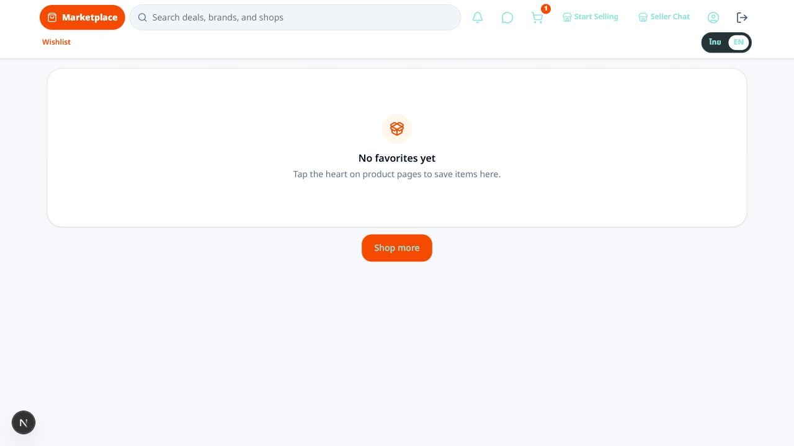
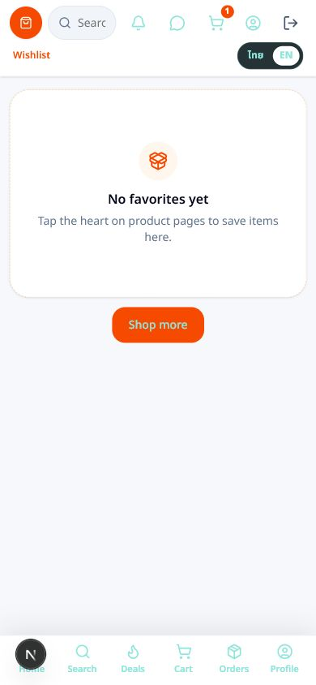

# Browser Evidence

## Desktop

## Mobile

## Notes

- Evidence was captured against `http://localhost:3000/en/wishlist`.
- The active demo buyer session had no saved products, so the captured state is the authenticated empty wishlist state.
- No browser console errors were captured during verification.
