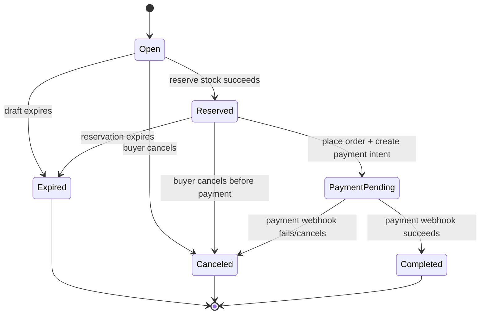
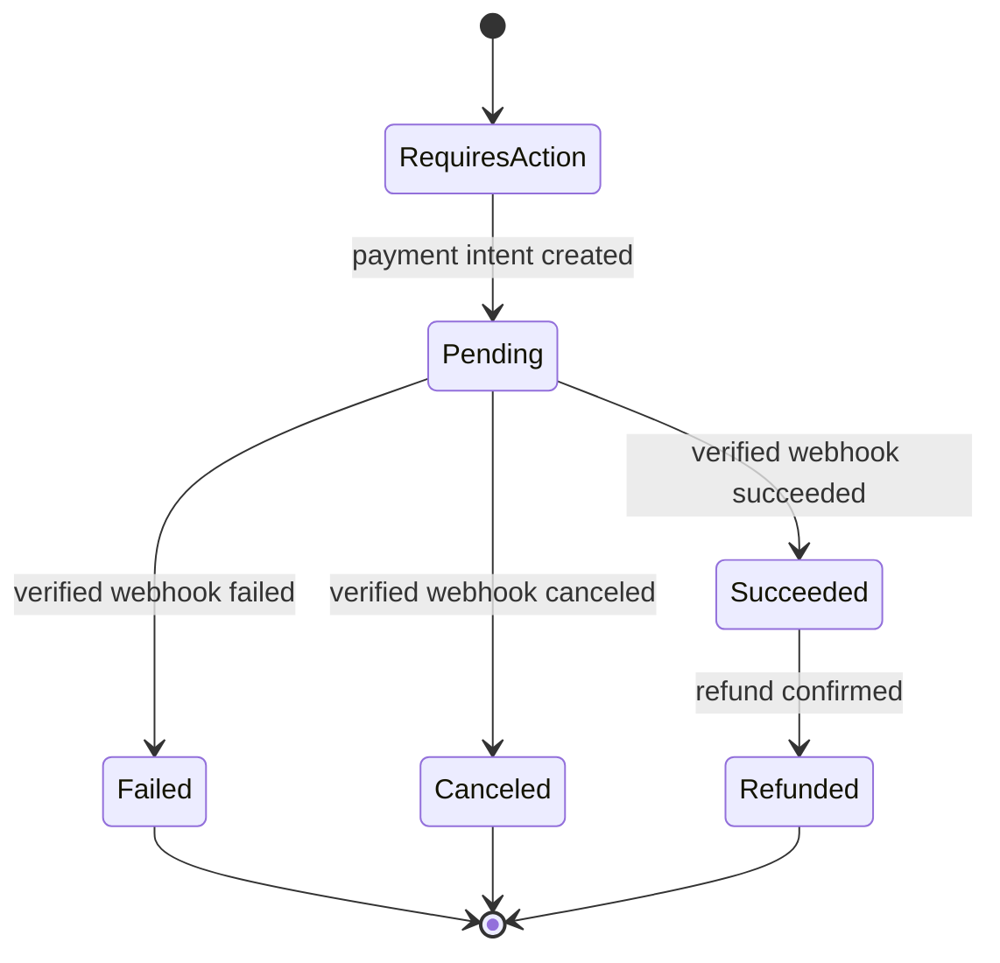
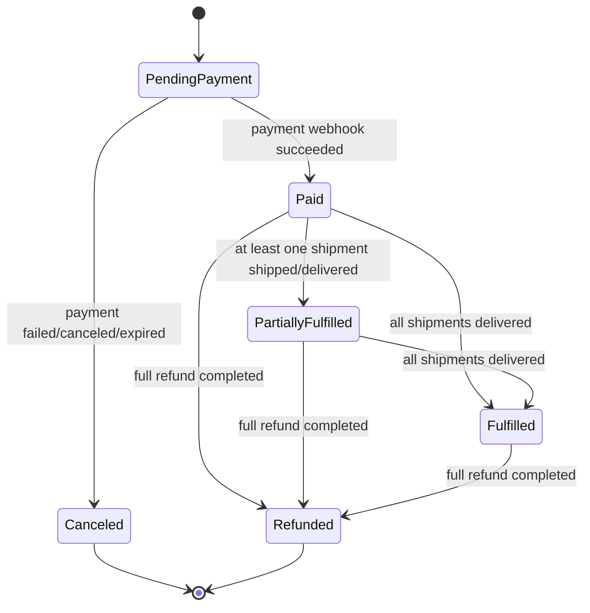
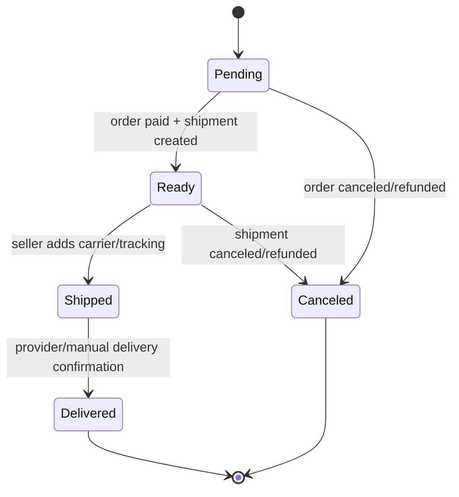
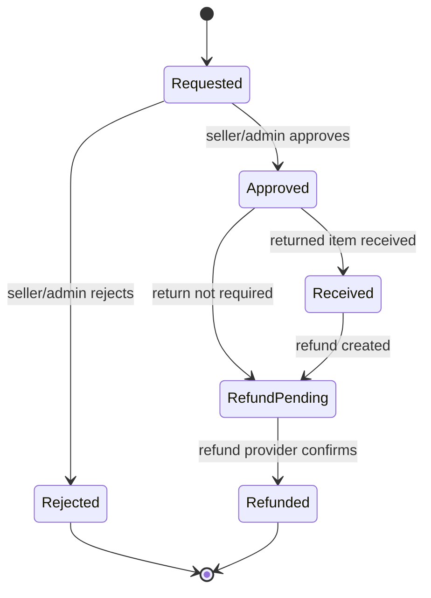
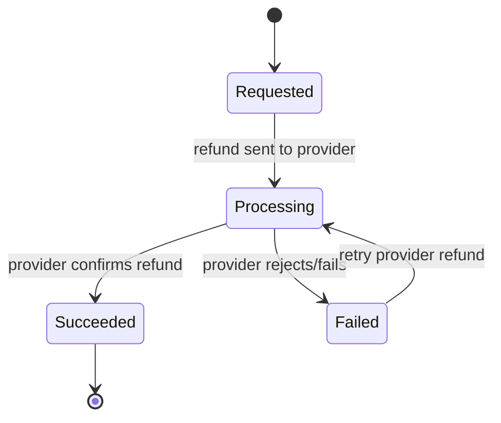

# Order, Payment, Shipment, Return, and Refund State Machines

This document defines allowed marketplace state transitions.

## Core Rules

- Payment success comes only from verified payment webhook.
- Checkout reserves stock before payment intent creation.
- Payment success commits reserved stock and creates shipments by shop.
- Payment failure, cancellation, or checkout expiry releases reserved stock.
- Shipments are split by shop.
- Refund completion should follow payment provider confirmation.

## Checkout State Machine

Invalid transitions:
- `Open` directly to `Completed`
- `PaymentPending` to `Completed` from browser redirect
- `Expired` back to `Reserved` without a new reservation

## Payment State Machine

Invalid transitions:
- `Pending` to `Succeeded` from client redirect
- duplicate webhook creating duplicate success side effects
- `Failed` to `Succeeded` without a new valid provider event model

## Order State Machine

Order status is derived from payment and shipment/refund state. Avoid hand-setting order status in unrelated flows.

## Shipment State Machine

Rules:
- Shipment belongs to one shop.
- Seller can only transition shipments for their shop.
- Shipment delivery can update order state when all shipments are delivered.

## Return State Machine

Rules:
- Buyer can request return/refund only for eligible order items.
- Approval may require seller or admin review.
- Refund completion should be provider-confirmed.

## Refund State Machine

## Idempotency Requirements

- Payment webhook idempotency key: provider event id.
- Shipping webhook idempotency key: provider event id or tracking event id.
- Refund provider confirmation idempotency key: provider refund event id.
- Duplicate events must return success or no-op after confirming the prior event was processed.

## Acceptance Checklist

- No client-only action can mark payment succeeded.
- Stock reservation, commit, and release are tied to state transitions.
- Shipments are created once per shop after payment success.
- Duplicate webhooks do not duplicate shipments or stock movement.
- Buyer, seller, and admin UIs display valid status labels only.
