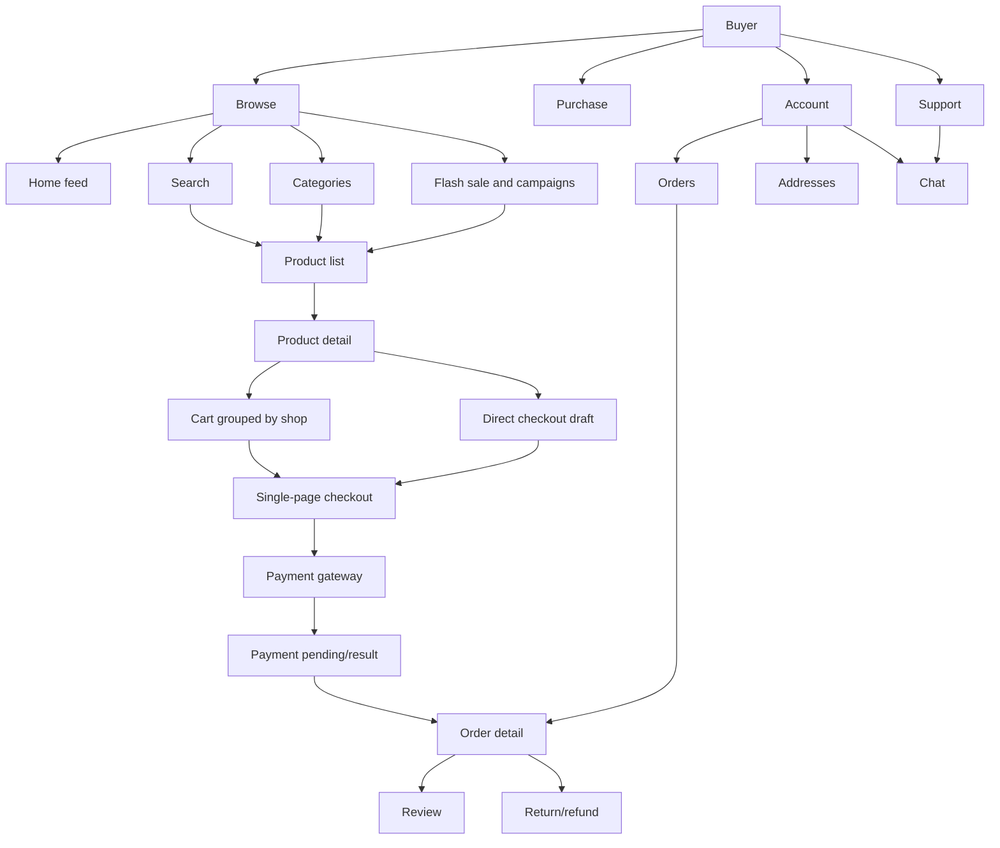
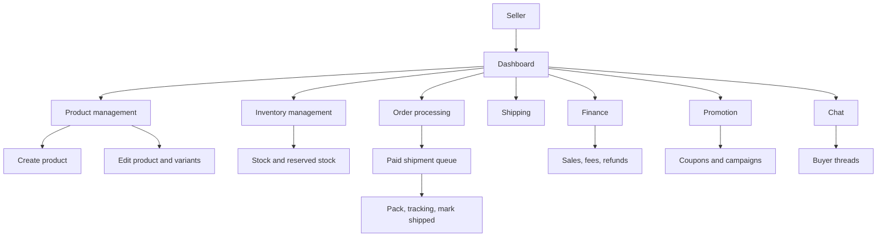
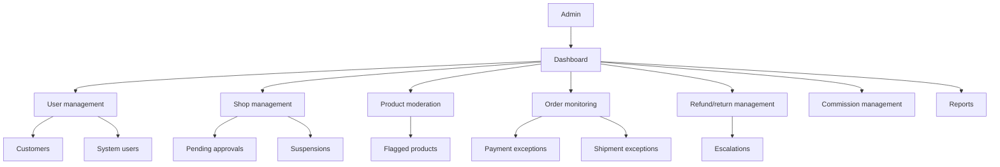
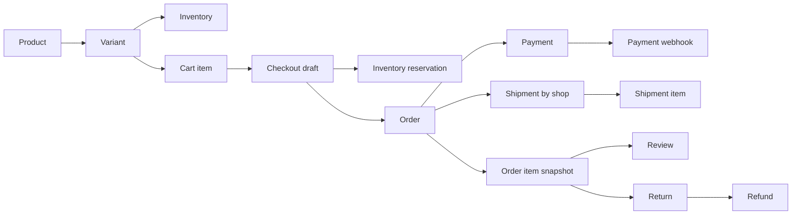

# Marketplace Information Architecture

This document defines the content model, navigation hierarchy, and screen relationships for the marketplace frontend. It is designed for mobile-first implementation and high-conversion shopping flows.

## IA Principles

- Discovery first: home, search, categories, deals, and recommendations must be reachable from the first viewport.
- Purchase path is short: product detail -> cart or buy now -> single-page checkout -> payment pending -> order tracking.
- Marketplace context is explicit: shop identity appears on product detail, cart groups, checkout groups, shipments, seller pages, and admin monitoring.
- Status is always clear: cart item availability, checkout reservation, payment, shipment, return, and refund states must be visible in plain language.
- Trust server state: price, stock, payment success, shipment status, and refund completion must come from backend/provider-confirmed state.

## Buyer IA

Buyer top-level areas:
- Browse
- Product discovery
- Product evaluation
- Cart and checkout
- Payment and order tracking
- Account and support

### Browse

Content groups:
- Sticky search header
- Promo strip and voucher chips
- Hero/campaign carousel
- Flash sale carousel
- Category grid
- Recommended product feed

Primary decisions:
- Search by intent.
- Tap a category.
- Open a campaign or flash sale item.
- Open a recommended product.

### Product Discovery

Product list pages include:
- Query/category/campaign context.
- Sort bar: relevance, newest, price, sales.
- Filter bottom sheet: category, price range, rating, shop, shipping.
- Infinite product grid.
- Skeleton loading, empty state, retry state, and end-of-feed state.

Card information hierarchy:
1. Product image
2. Discount or campaign badge
3. Product title, max two lines
4. Price in cents formatted as currency
5. Rating and sold count
6. Shop or free shipping signal
7. Quick add or product detail entry

### Product Detail

Product detail content hierarchy:
1. Image carousel
2. Price, discount, campaign timer if any
3. Title, rating, sold count
4. Variant picker and quantity
5. Shipping estimate
6. Shop card and chat seller action
7. Reviews
8. Product description/specs
9. Recommendations

Fixed controls:
- Sticky bottom CTA with Add to Cart and Buy Now.
- CTA must stay above safe-area bottom and never cover important content.
- Variant picker opens before Add to Cart or Buy Now if required options are missing.

### Cart

Cart is grouped by shop:
- Shop header with shop name, selected checkbox, voucher entry.
- Item rows with variant snapshot, price, quantity, availability.
- Shop-level subtotal and estimated shipping.
- Sticky selected total and checkout CTA.

Cart states:
- Empty cart.
- Product removed.
- Variant out of stock.
- Quantity exceeds stock.
- Shop suspended or unavailable.
- Price changed since last view.

### Checkout

Checkout is a single-page flow:
- Address snapshot selection.
- Shop-grouped item summary.
- Shipping method per shop.
- Coupon/voucher entry.
- Payment method.
- Totals breakdown.
- Reservation timer after stock is reserved.
- Sticky place order CTA.

Checkout backend order:
1. Validate selected items.
2. Calculate trusted prices and shipping.
3. Reserve stock with expiry.
4. Create pending order.
5. Create payment intent.
6. Redirect or open gateway payment.

### Payment and Tracking

Payment return page:
- Shows payment pending by default after gateway return.
- Polls trusted payment/order status.
- Never displays success solely from URL parameters.

Order detail groups:
- Order status.
- Payment status.
- Shipment cards by shop.
- Item snapshots.
- Tracking timeline.
- Review and return/refund actions when eligible.

## Seller IA

Seller top-level areas:
- Dashboard
- Products
- Inventory
- Orders and shipping
- Finance
- Promotions
- Chat

Seller dashboard priority:
1. Paid shipments waiting to be processed.
2. Low-stock variants.
3. Product moderation issues.
4. Unread chats.
5. Sales and refund summary.

Seller constraints:
- Seller only sees owned shop resources.
- Order processing is shipment-based, because one buyer order can contain items from many shops.
- Inventory UI must show available stock, reserved stock, and low-stock warnings.

## Admin IA

Admin top-level areas:
- Dashboard
- User management
- Shop management
- Product moderation
- Order monitoring
- Refund/return management
- Commission management
- Reports

Admin dashboard priority:
1. Payment and webhook exceptions.
2. Shipment delays and fulfillment SLA issues.
3. Refund/return escalations.
4. Product moderation queue.
5. Shop approval/suspension issues.
6. Sales and conversion reports.

## Cross-Domain Data Relationships

Frontend display rules:
- Product cards use current catalog data.
- Order items use snapshot fields and must not change when catalog data changes later.
- Shipping address on orders uses snapshot fields.
- Cart and checkout use live validation and may show price/stock changes.
- Shipment tracking is grouped by shop shipment.

## API Dependency Map

| UI Area | Primary Data | Required APIs |
| --- | --- | --- |
| Home feed | Campaigns, categories, product cards | `GET /api/catalog/products`, `GET /api/categories` |
| Search | Suggestions, products, filters | `GET /api/search/suggestions`, `GET /api/catalog/products` |
| Product detail | Product, variants, inventory, reviews, shop | `GET /api/catalog/products/:productId`, `GET /api/products/:productId/reviews` |
| Cart | Shop-grouped cart, availability, selected total | `GET /api/cart`, cart item mutations |
| Checkout | Address, shipping, coupons, totals, reservations | checkout create/update/reserve/place-order APIs |
| Payment return | Trusted payment and order status | `GET /api/orders/:orderId/payment-status` |
| Order tracking | Order, payment, shipment cards, timeline | `GET /api/orders/:orderId` |
| Seller operations | Products, inventory, shipment queue | seller product, inventory, shipment APIs |
| Admin operations | Users, shops, moderation, orders, refunds, reports | admin APIs |

## State Ownership

- Frontend owns transient UI state: selected filters, open sheets, selected variant before add, visible feed batch, optimistic UI indicators.
- Backend owns business state: price, stock, reservation, order, payment, shipment, return, refund, user role, shop ownership.
- Providers own external confirmations: payment gateway webhook for payment success, shipping provider callback for tracking events when available.

## MVP IA Priority

Build in this order:
1. Browse and product discovery.
2. Product detail with sticky CTA.
3. Cart grouped by shop.
4. Single-page checkout with stock reservation.
5. Payment pending/result with webhook-only success.
6. Order tracking with shipments by shop.
7. Seller shipment processing.
8. Admin monitoring for users, shops, orders, refunds, and moderation.
