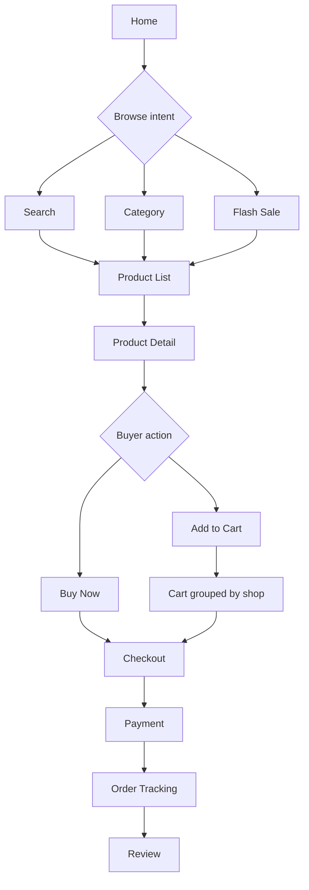
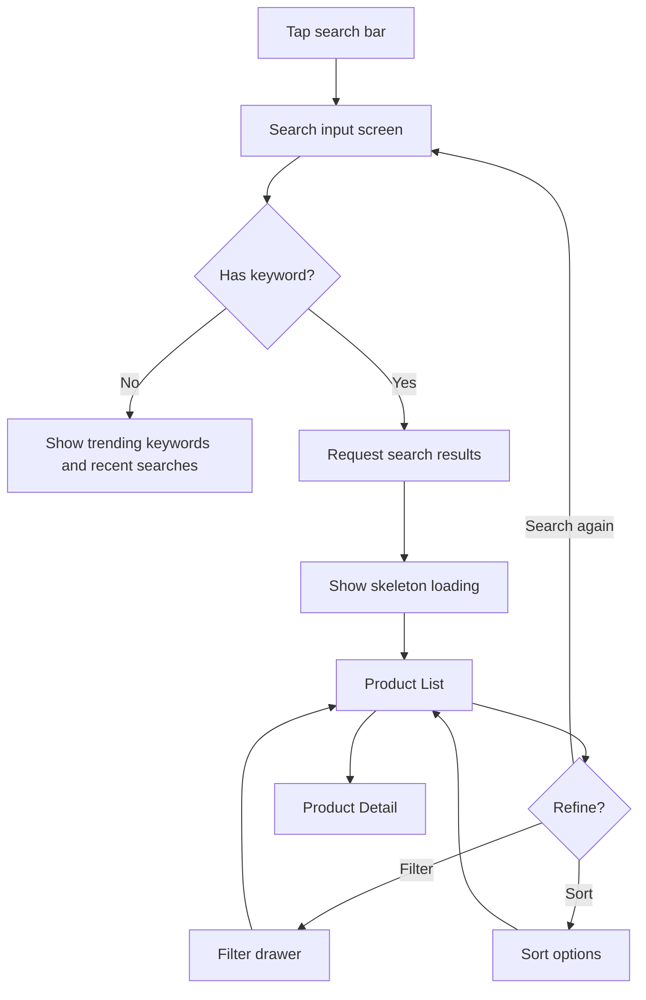
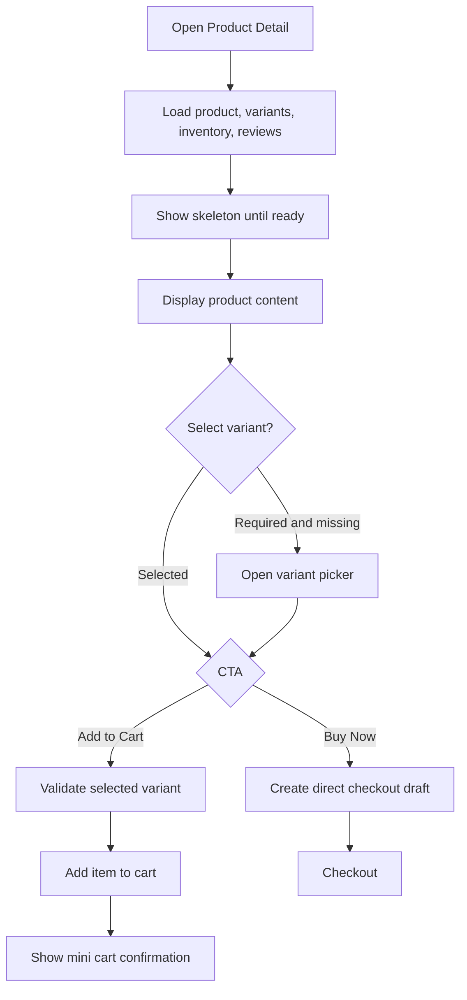
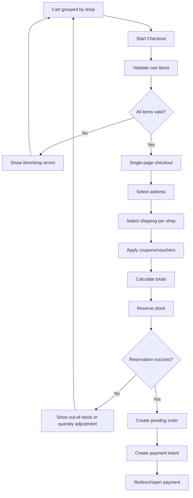
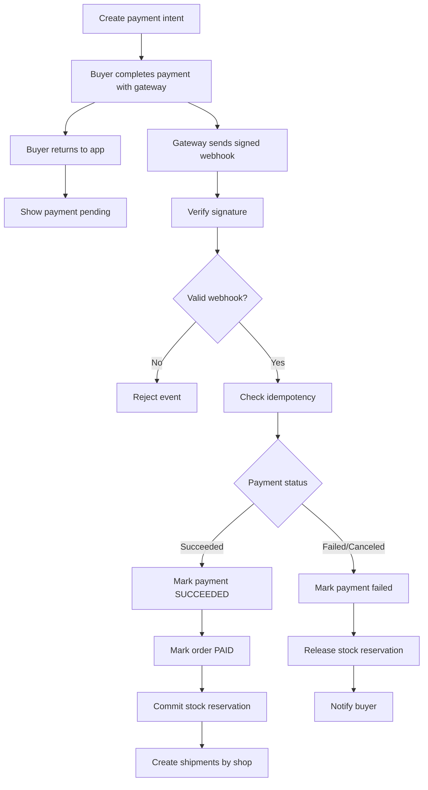
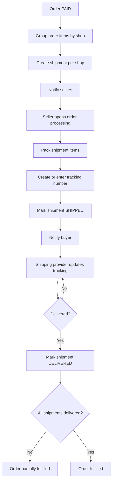
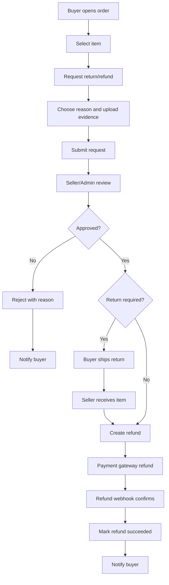
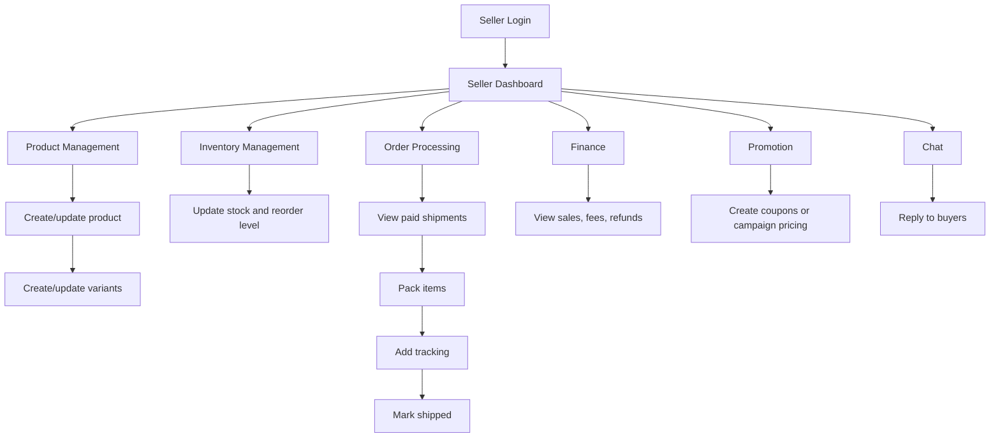
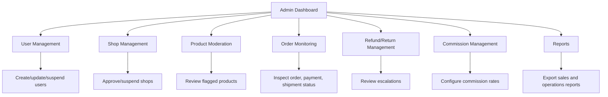

# Marketplace User Flow

This document defines practical frontend user flows for a mobile-first multi-vendor marketplace similar to Shopee/Lazada.

Core platform rules:
- Buyers can purchase products from many shops in one order.
- Cart and checkout must group items by shop.
- Checkout must reserve stock before payment.
- Payment success must be confirmed by payment gateway webhook only.
- One order can be split into multiple shipments by shop.
- UX must be optimized for mobile conversion first.

Related frontend planning documents:
- [Sitemap](./sitemap.md)
- [Information Architecture](./information-architecture.md)
- [Mobile-First Wireframes](./mobile-wireframes.md)

## User Types

- **Guest**
  - Can browse home, search, category, product list, and product detail.
  - Must log in before cart checkout or writing reviews.

- **Buyer**
  - Can add to cart, checkout, pay, track orders, chat with sellers, request returns/refunds, and review purchased products.

- **Seller**
  - Can manage products, variants, inventory, promotions, chats, shop orders, shipping, and finance views.

- **Admin**
  - Can manage users, shops, product moderation, order monitoring, returns/refunds, commissions, and reports.

- **Payment Gateway**
  - Creates payment intent/session.
  - Sends signed webhooks.
  - Webhook is the only trusted source for payment success/failure.

- **Shipping Provider**
  - Receives shipment details.
  - Provides tracking number and delivery events.
  - Updates shipment status through API/webhook/manual seller input.

## Buyer Flow

Buyer journey:
- Home
- Search
- Category
- Product List
- Product Detail
- Add to Cart
- Cart
- Checkout
- Payment
- Order Tracking
- Review

Buyer UX expectations:
- Home and product feeds use infinite scroll.
- Search, filter, and sort must feel instant.
- Product detail uses sticky bottom CTA.
- Cart is grouped by shop.
- Checkout is a single-page flow.
- Order tracking clearly shows per-shop shipment status.

## Search Flow

Search requirements:
- Search box must be visible near the top of mobile screens.
- Support keyword, category, price range, rating, shop, and shipping filters.
- Product list should support sort by relevance, newest, price, and sales.
- Empty search must provide popular keywords and category shortcuts.

## Product Detail Flow

Product detail requirements:
- Sticky bottom CTA with Add to Cart and Buy Now.
- Show price, discount, rating, sold count, shipping info, shop card, variants, and reviews.
- Variant selection is required before cart/checkout when product has variants.
- Stock must be checked before adding to cart and again during checkout reservation.

## Checkout Flow

Checkout requirements:
- Single-page checkout.
- Group cart items by shop.
- Allow address, shipping method, coupon, and payment method selection.
- Reserve stock before payment intent creation.
- Reservation must expire if checkout is abandoned.
- Buyer must see clear stock/price/shipping errors before payment.

## Payment Flow

Payment requirements:
- Browser redirect is not proof of payment success.
- Payment success/failure must be updated only from verified webhook.
- Payment events must be idempotent by provider event ID.
- UI should show pending state after returning from payment page until webhook updates order.

## Fulfillment Flow

Fulfillment requirements:
- Split one order into shipments by shop.
- Each seller only processes shipment items for their shop.
- Shipment item quantities support partial shipment.
- Buyer order tracking must show overall order status and per-shop shipment status.

## Return/Refund Flow

Return/refund requirements:
- Buyer can request return/refund from eligible delivered or paid order items.
- Return is reviewed by seller/admin.
- Refund completion should follow payment provider confirmation.
- Return and refund statuses must be clear to buyer.

## Seller Flow

Seller journey:
- Login
- Dashboard
- Product Management
- Inventory Management
- Order Processing
- Shipping
- Finance
- Promotion
- Chat

Seller UX expectations:
- Dashboard shows pending orders, low stock, active promotions, and unread chats.
- Product management supports variants and image/content readiness.
- Inventory updates must be fast and low-friction.
- Order processing is grouped by shipment/shop responsibility.

## Admin Flow

Admin journey:
- Dashboard
- User Management
- Shop Management
- Product Moderation
- Order Monitoring
- Refund/Return Management
- Commission Management
- Reports

Admin UX expectations:
- Dashboard highlights operational exceptions.
- Admin can inspect users, shops, products, orders, refunds, and reports.
- Product moderation should prioritize flagged or newly submitted products.
- Order monitoring should make payment/shipment failures visible quickly.

## UX Rules

- **Mobile-first**
  - Design for 360-430px width first.
  - Use bottom navigation for primary buyer actions.
  - Keep tap targets at least 44px high.

- **Sticky bottom CTA on product detail**
  - Product detail must always expose Add to Cart and Buy Now.
  - CTA must sit above safe-area bottom and not cover content.

- **Single-page checkout**
  - Address, shipping, coupon, payment, and summary stay on one screen.
  - Use collapsible sections for mobile density.

- **Cart grouped by shop**
  - Show shop name, shop-level shipping, shop coupons, and item subtotal.
  - Allow selecting/removing items per shop.

- **Clear order status**
  - Show order-level status and per-shop shipment status.
  - Use plain labels such as Pending Payment, Paid, Shipped, Delivered, Return Requested, Refunded.

- **Fast search/filter/sort**
  - Search input stays easy to reach.
  - Filters use bottom sheet on mobile.
  - Sorting options should be one tap.

- **Skeleton loading**
  - Use skeletons for home feed, product list, product detail, cart, and checkout totals.
  - Avoid blank screens.

- **Infinite scroll for product feeds**
  - Home and category product feeds load incrementally.
  - Keep scroll position stable when new items append.
  - Provide loading and end-of-feed states.

## MVP Priority

Build these first:
- Browse products
- Product detail
- Cart
- Checkout
- Payment
- Seller order processing
- Shipment tracking

Recommended MVP sequencing:
1. Product browsing and product detail.
2. Cart grouped by shop.
3. Checkout with stock reservation.
4. Payment intent and webhook-confirmed payment success.
5. Shipment creation by shop.
6. Seller shipment processing.
7. Buyer shipment tracking.

## Out of Scope for MVP

- Live commerce
- Affiliate system
- Advanced recommendation engine
- Seller wallet/payout automation
- Dispute center automation

## Implementation Notes for Future Agents

- Keep buyer frontend routes mobile-first and conversion-focused.
- Do not trust payment redirects for order success.
- Do not decrement final stock until payment webhook confirms success.
- Keep cart, checkout, payment, shipment, return, and refund states explicit.
- Prefer small feature modules and shared UI primitives.
- Avoid adding cart/checkout UI behavior before the backend state model is ready.

## Sitemap

Buyer-facing routes:
- `/` - Marketplace home feed, flash sale, category grid, recommendations.
- `/search` - Search input, recent searches, trending keywords.
- `/search?q=<keyword>` - Search results with filter/sort.
- `/categories` - Category index.
- `/categories/:slug` - Category product feed.
- `/products/:productId` - Product detail.
- `/cart` - Cart grouped by shop.
- `/checkout` - Single-page checkout.
- `/payment/return` - Payment return page showing pending webhook confirmation.
- `/orders` - Buyer order list.
- `/orders/:orderId` - Order detail with per-shop shipment tracking.
- `/orders/:orderId/review` - Review purchased items.
- `/orders/:orderId/returns/new` - Return/refund request.
- `/account` - Buyer account overview.
- `/account/addresses` - Address book.
- `/chat` - Buyer chat inbox.
- `/chat/:threadId` - Buyer/seller chat thread.

Seller routes:
- `/seller/login` - Seller login or redirect to shared auth.
- `/seller/register` - Shop onboarding, Thailand KYC, pickup address, payout, and document upload.
- `/seller/status` - Pending/rejected seller application status and resubmission path.
- `/seller` - Seller dashboard.
- `/seller/products` - Product management list.
- `/seller/products/new` - Create product.
- `/seller/products/:productId` - Edit product, variants, images, status.
- `/seller/inventory` - Inventory and low-stock management.
- `/seller/orders` - Seller shipment/order queue.
- `/seller/orders/:shipmentId` - Shipment processing detail.
- `/seller/shipping` - Shipping labels and tracking management.
- `/seller/finance` - Sales, fees, refunds, payout summary.
- `/seller/promotions` - Coupons and campaign participation.
- `/seller/chat` - Seller chat inbox.

Admin routes:
- `/admin` - Admin dashboard.
- `/admin/users` - User management.
- `/admin/shops` - Shop approval and suspension.
- `/admin/products` - Product moderation.
- `/admin/orders` - Order monitoring.
- `/admin/refunds` - Refund/return management.
- `/admin/commissions` - Commission configuration.
- `/admin/reports` - Operational and sales reports.

System/API-only callbacks:
- `/api/payments/webhook` - Payment gateway webhook.
- `/api/shipping/webhook` - Shipping provider webhook or status callback.

## Frontend Page Inventory

### Buyer Pages

- **Home**
  - Sections: sticky search header, hero/promo carousel, voucher strip, flash sale, category grid, recommended feed, mobile bottom nav.
  - States: loading skeleton, feed empty, feed error with retry, infinite-scroll loading, end of feed.
  - Primary actions: search, open category, open product, claim voucher, add product shortcut.

- **Search**
  - Sections: search input, recent searches, trending keywords, results feed, filter drawer, sort bar.
  - States: no query, loading, no results, filtered results, error.
  - Primary actions: submit keyword, select filter, sort, open product.

- **Category Product List**
  - Sections: category header, subcategory chips, filter/sort controls, infinite product grid.
  - States: loading, empty category, filtered empty, end of feed.
  - Primary actions: filter, sort, open product.

- **Product Detail**
  - Sections: image carousel, price/discount, title, rating/sold count, variant picker, shipping info, shop card, reviews, recommendations.
  - States: loading skeleton, unavailable product, variant required, out of stock, add-to-cart success.
  - Primary actions: Add to Cart, Buy Now, chat seller, favorite.

- **Cart**
  - Sections: shop-grouped cart items, shop vouchers, shipping preview, selected total, sticky checkout CTA.
  - States: empty cart, item unavailable, quantity exceeds stock, shop-level errors.
  - Primary actions: select items, edit quantity, remove item, checkout selected.

- **Checkout**
  - Sections: address, items grouped by shop, shipping per shop, coupon/voucher, payment method, order summary, reservation timer.
  - States: calculating totals, reservation failed, price changed, address missing, payment intent failed.
  - Primary actions: place order, edit address, change shipping, apply coupon.

- **Payment Return**
  - Sections: pending payment state, order number, next-step instructions.
  - States: pending webhook, payment failed, payment confirmed.
  - Primary rule: never mark success from browser return alone.

- **Order Detail / Tracking**
  - Sections: order status, payment status, shipment cards by shop, tracking timeline, item list, support actions.
  - States: pending payment, paid, partially shipped, shipped, delivered, canceled, refunded.
  - Primary actions: track shipment, chat seller, request return/refund, review.

- **Review**
  - Sections: purchased item list, rating input, text/photo review, submit state.
  - States: already reviewed, review window closed, upload failure.

### Seller Pages

- **Seller Dashboard**
  - Sections: KPI cards, pending shipments, low-stock alerts, unread chats, campaign status.
  - States: loading, empty shop, verification pending, suspended shop.

- **Product Management**
  - Sections: product table/cards, status filters, create/edit product, variant editor.
  - States: draft, active, archived, rejected by moderation.

- **Inventory Management**
  - Sections: variant inventory table, low-stock filter, reserved stock visibility, bulk edit controls.
  - States: save pending, validation error, conflict with reserved stock.

- **Order Processing**
  - Sections: paid shipment queue, pick/pack checklist, shipment item quantities, tracking input.
  - States: ready to ship, partially shipped, shipped, canceled/refunded.

- **Finance**
  - Sections: sales summary, fees, refunds, commission estimate, payout placeholder.
  - MVP note: payout automation is out of scope.

- **Promotion**
  - Sections: coupon list, create coupon, campaign enrollment, active promotion performance.

- **Chat**
  - Sections: thread list, buyer context, order context, reply box.

### Admin Pages

- **Dashboard**
  - Sections: operational exception cards, sales overview, moderation queue, refund escalations.

- **User Management**
  - Sections: customer users, system users, role management, account status.

- **Shop Management**
  - Sections: pending shops, active shops, suspended shops, verification detail.

- **Product Moderation**
  - Sections: flagged products, new submissions, moderation decision panel.

- **Order Monitoring**
  - Sections: order search, payment status, shipment status, exception filters.

- **Refund/Return Management**
  - Sections: escalation queue, evidence review, decision history, refund status.

- **Commission Management**
  - Sections: default rates, shop/category overrides, effective commission preview.

- **Reports**
  - Sections: GMV, order count, conversion, fulfillment SLA, refund rate, export controls.

## Wireframe Requirements

Mobile-first wireframes must be produced for these screens before detailed UI implementation:
- Buyer Home
- Search Results
- Category Product List
- Product Detail
- Cart
- Checkout
- Payment Pending/Result
- Order Detail / Tracking
- Return Request
- Seller Dashboard
- Seller Product Management
- Seller Order Processing
- Admin Dashboard
- Admin User Management
- Admin Order Monitoring

Wireframe rules:
- Use 360px and 430px mobile widths first.
- Define sticky header, sticky bottom CTA, and mobile bottom nav positions.
- Show loading, empty, error, and success states when they affect layout.
- Show how shop grouping appears in cart, checkout, and tracking.
- Show per-shop shipment cards in order detail.
- Keep every primary CTA visible without scrolling on critical pages: product detail, cart, checkout, payment pending.

## Frontend Component Requirements

Shared buyer components:
- `MobileCommerceHeader`
- `MobileBottomNav`
- `StickyBottomCTA`
- `ProductCard`
- `ProductGrid`
- `FlashSaleCarousel`
- `CategoryGrid`
- `FilterSortBar`
- `FilterBottomSheet`
- `ShopGroupedCart`
- `CheckoutSummary`
- `ShipmentStatusCard`
- `OrderTimeline`
- `SkeletonFeed`
- `EmptyState`
- `ErrorRetry`

Seller/admin shared components:
- `DashboardMetricCard`
- `ManagementDataTable`
- `StatusBadge`
- `ModerationPanel`
- `ShipmentProcessingCard`
- `ChatThreadList`

Implementation rules:
- Keep buyer page components under `app/features/marketplace/`.
- Keep seller page components under `app/features/seller/`.
- Keep admin-only operational UI under `app/features/admin/` or the relevant domain feature.
- Shared UI primitives stay under `app/components/ui/`.
- Do not duplicate API response types; infer where Eden Treaty is available.

## API Requirements

### Catalog and Search

- `GET /api/catalog/products`
  - Query: `q`, `categoryId`, `shopId`, `status`, `minPrice`, `maxPrice`, `rating`, `sort`, `cursor`, `limit`.
  - Returns: product cards with product id, title, slug, primary image, price range, discount, rating, sold count, shop summary, free shipping flag, stock hint.
  - Used by: home feed, search, category product list.

- `GET /api/catalog/products/:productId`
  - Returns: product detail, images, variants, inventory availability, shop card, shipping options, review summary, related products.
  - Used by: product detail.

- `GET /api/categories`
  - Returns: category tree, icon, slug, sort order.
  - Used by: home category grid and category pages.

- `GET /api/search/suggestions`
  - Query: `q`.
  - Returns: keyword suggestions, shops, categories.
  - Used by: search input.

### Cart

- `GET /api/cart`
  - Returns: cart grouped by shop, item availability, quantity, selected state, shop vouchers, estimated shipping.

- `POST /api/cart/items`
  - Body: `variantId`, `quantity`.
  - Behavior: validates product/variant availability but final stock reservation happens at checkout.

- `PATCH /api/cart/items/:itemId`
  - Body: `quantity`, `selected`.
  - Behavior: updates quantity or selection.

- `DELETE /api/cart/items/:itemId`
  - Behavior: removes item.

### Checkout

- `POST /api/checkout`
  - Body: selected cart item ids or direct buy variant payload.
  - Behavior: validates cart, groups by shop, calculates totals, creates checkout draft.

- `PATCH /api/checkout/:checkoutId`
  - Body: address id, shipping selections per shop, coupon codes, payment method.
  - Behavior: recalculates totals.

- `POST /api/checkout/:checkoutId/reserve`
  - Behavior: reserves stock for checkout items with expiry.
  - Failure: returns per-item stock errors.

- `POST /api/checkout/:checkoutId/place-order`
  - Behavior: creates pending order and payment intent after successful reservation.

### Payment

- `POST /api/payments/:orderId/intent`
  - Behavior: creates or reuses payment intent/session.

- `POST /api/payments/webhook`
  - Called by payment gateway.
  - Must verify signature.
  - Must be idempotent by provider event id.
  - Only this endpoint can mark payment as succeeded.

- `GET /api/orders/:orderId/payment-status`
  - Returns: pending, succeeded, failed, canceled, refunded.
  - Used by payment return page polling.

### Orders and Fulfillment

- `GET /api/orders`
  - Query: `status`, `cursor`, `limit`.
  - Returns: buyer order cards with order status, payment status, shipment summary.

- `GET /api/orders/:orderId`
  - Returns: order detail, shop-grouped items, payment status, shipment cards, tracking timeline, return/refund eligibility.

- `POST /api/seller/shipments/:shipmentId/ship`
  - Body: carrier, tracking number, shipped item quantities.
  - Used by seller order processing.

- `GET /api/seller/shipments`
  - Query: status, date range.
  - Returns: seller shipment queue.

- `POST /api/shipping/webhook`
  - Called by shipping provider if supported.
  - Updates tracking and delivery status.

### Reviews

- `POST /api/orders/:orderId/reviews`
  - Body: order item id, rating, body, images.
  - Behavior: only allows review for purchased eligible item.

- `GET /api/products/:productId/reviews`
  - Query: rating, cursor, limit.
  - Returns: review list and summary.

### Returns and Refunds

- `POST /api/orders/:orderId/returns`
  - Body: order item ids, quantities, reason, evidence.
  - Behavior: creates return/refund request.

- `GET /api/returns/:returnId`
  - Returns: return status, required buyer/seller actions, refund status.

- `POST /api/admin/returns/:returnId/decision`
  - Body: approve/reject, reason, refund amount.

- `POST /api/refunds/:refundId/process`
  - Behavior: sends refund request to payment gateway.
  - Completion should be confirmed by provider response/webhook.

### Seller

- `GET /api/seller/application`
  - Auth: authenticated user.
  - Returns: current application, linked shop status, masked KYC fields, and document metadata.

- `POST /api/seller/application/draft`
  - Auth: authenticated user.
  - Saves draft onboarding data and KYC document references.

- `POST /api/seller/application/submit`
  - Auth: authenticated user.
  - Validates KYC data/documents and moves application into admin review.

- `GET /api/seller/dashboard`
  - Auth: active shop owner.
  - Returns: pending shipments, low-stock variants, active promotions, unread chats, finance summary.

- `GET /api/seller/products`
  - Auth: active shop owner.
  - Returns: seller-owned product list.

- `POST /api/seller/products`
  - Auth: active shop owner.
  - Creates product and variants for seller shop.

- `PATCH /api/seller/products/:productId`
  - Auth: active shop owner.
  - Updates product content/status.

- `PATCH /api/seller/variants/:variantId/inventory`
  - Auth: active shop owner.
  - Updates inventory fields.

- `GET /api/seller/finance`
  - Auth: active shop owner.
  - Returns: sales, fees, refunds, payout placeholder.

- `GET /api/seller/promotions`
  - Auth: active shop owner.
  - Returns: coupons and campaigns.

### Admin

- `GET /api/admin/dashboard`
  - Returns: operational metrics and exception queues.

- `GET /api/admin/users`
  - Returns: customers and system users.

- `GET /api/admin/seller-applications`
  - Returns: seller application review queue.

- `PATCH /api/admin/seller-applications/:applicationId/review`
  - Approves or rejects seller applications.
  - Approval activates the shop and unlocks seller operations.

- `GET /api/admin/shops`
  - Query: status.
  - Returns: shop approval/suspension list.

- `PATCH /api/admin/shops/:shopId/status`
  - Updates shop status.

- `GET /api/admin/products/moderation`
  - Returns: flagged/pending products.

- `PATCH /api/admin/products/:productId/moderation`
  - Body: approve/reject/reason.

- `GET /api/admin/orders`
  - Query: status, paymentStatus, shipmentStatus, q.
  - Returns: order monitoring list.

- `GET /api/admin/reports`
  - Query: date range, report type.
  - Returns: report data for dashboards/export.

## State and Status Requirements

Product statuses:
- Draft
- Active
- Archived
- Rejected

Cart item states:
- Available
- Quantity changed
- Out of stock
- Product removed
- Shop suspended

Checkout statuses:
- Open
- Reserved
- Payment pending
- Completed
- Expired
- Canceled

Payment statuses:
- Requires action
- Pending
- Succeeded
- Failed
- Canceled
- Refunded

Order statuses:
- Pending payment
- Paid
- Partially fulfilled
- Fulfilled
- Canceled
- Refunded

Shipment statuses:
- Pending
- Ready
- Shipped
- Delivered
- Canceled

Return/refund statuses:
- Requested
- Approved
- Rejected
- Received
- Refund pending
- Refunded

## Acceptance Checklist

The document is complete enough for implementation when:
- Sitemap routes are mapped for buyer, seller, admin, and callbacks.
- Every MVP page has required sections, states, and primary actions.
- Wireframe requirements identify mobile sizes and critical sticky UI.
- API requirements identify endpoint purpose, required inputs, and frontend consumers.
- Payment and stock reservation rules are explicitly represented.
- Multi-shop cart, checkout, order, and shipment behavior is explicit.
