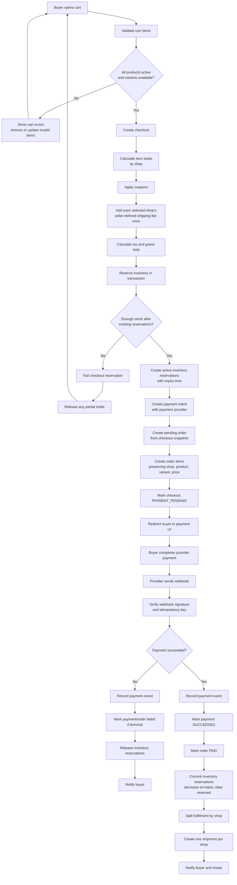

# Checkout Flow

Rules:
- Stock is reserved before the buyer enters payment to prevent oversell.
- Reservations must expire and release automatically if checkout is abandoned.
- The browser return page can show pending status, but it must not mark payment successful.
- Payment success is accepted only from a verified provider webhook.
- Order items store shop and price snapshots because catalog data can change later.
- Manual shipping fees are configured by each seller in baht, stored in minor units, and charged once per selected shop.
