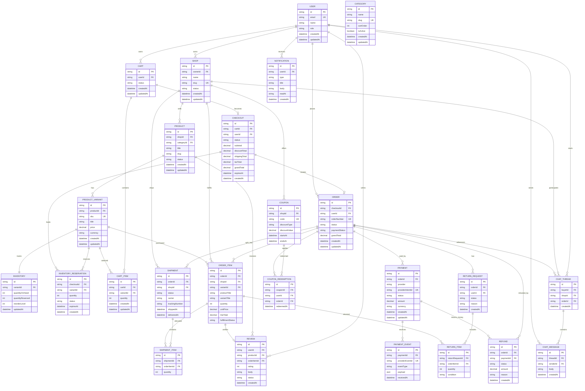

# Marketplace ERD

Notes:
- A single `ORDER` can contain `ORDER_ITEM` rows from many shops.
- Fulfillment is split by `SHIPMENT.shopId`, with `SHIPMENT_ITEM` allocating order item quantities.
- `INVENTORY_RESERVATION` holds stock during checkout and expires if checkout is abandoned.
- `PAYMENT.status = succeeded` must be set from verified `PAYMENT_EVENT` webhook data, not from browser redirect state.
