# Marketplace ERD

```mermaid
erDiagram
  USER {
    string id PK
    string email UK
    string name
    string role
    string status
    datetime createdAt
    datetime updatedAt
  }

  SELLER_PROFILE {
    string id PK
    string userId FK
    string businessType
    string verificationStatus
    string legalName
    string displayName
    int maxShopCount
    datetime verifiedAt
    datetime createdAt
    datetime updatedAt
  }

  SELLER_APPLICATION {
    string id PK
    string userId FK
    string shopId FK
    string sellerProfileId FK
    string status
    string businessType
    string shopName
    string shopSlug
    string legalName
    string bankName
    datetime submittedAt
    datetime reviewedAt
    string reviewedById FK
  }

  SELLER_KYC_DOCUMENT {
    string id PK
    string applicationId FK
    string uploadId UK
    string documentType
    string side
    int sortOrder
  }

  SHOP {
    string id PK
    string ownerId FK
    string sellerProfileId FK
    string name
    string slug UK
    string contactEmail
    string contactPhone
    string status
    string approvedById FK
    datetime approvedAt
    datetime createdAt
    datetime updatedAt
  }

  SHOP_STAFF {
    string id PK
    string shopId FK
    string userId FK
    string role
    string status
    string invitedById FK
    datetime joinedAt
  }

  SHOP_STAFF_PERMISSION {
    string id PK
    string staffId FK
    string permission
  }

  SHOP_ADDRESS {
    string id PK
    string shopId FK
    string type
    string contactName
    string line1
    string city
    string postalCode
    string country
    boolean isDefault
  }

  SHOP_WALLET {
    string id PK
    string shopId FK
    string currency
    bigint balance
    bigint pendingBalance
    bigint withdrawableBalance
  }

  WALLET_LEDGER_ENTRY {
    string id PK
    string walletId FK
    string shopId FK
    string type
    bigint amount
    string currency
    string orderId FK
    string payoutId FK
    string refundId FK
  }

  SELLER_PAYOUT {
    string id PK
    string walletId FK
    string shopId FK
    bigint amount
    string currency
    string status
    string requestedById FK
    string approvedById FK
    string rejectedById FK
    string paidById FK
  }

  SELLER_TRANSACTION {
    string id PK
    string walletId FK
    string sellerProfileId FK
    string shopId FK
    string type
    string status
    bigint amount
    string currency
    string orderId FK
    string payoutId FK
    string refundId FK
  }

  PRODUCT {
    string id PK
    string shopId FK
    string sellerProfileId FK
    string categoryId FK
    string title
    string titleTh
    string titleEn
    string slug
    string descriptionTh
    string descriptionEn
    string status
    datetime createdAt
    datetime updatedAt
  }

  CATEGORY {
    string id PK
    string name
    string nameTh
    string nameEn
    string slug UK
    int sortOrder
    boolean isActive
  }

  PRODUCT_VARIANT {
    string id PK
    string productId FK
    string sku
    string title
    bigint price
    string currency
    string status
  }

  INVENTORY {
    string id PK
    string variantId FK
    int quantityOnHand
    int quantityReserved
    int reorderLevel
    int version
  }

  INVENTORY_RESERVATION {
    string id PK
    string checkoutId FK
    string orderId FK
    string inventoryId FK
    int quantity
    string status
    datetime expiresAt
  }

  CART {
    string id PK
    string userId FK
    string status
  }

  CART_ITEM {
    string id PK
    string cartId FK
    string variantId FK
    int quantity
    bigint unitPrice
    string currency
  }

  CHECKOUT {
    string id PK
    string cartId FK
    string userId FK
    string status
    bigint subtotal
    bigint discountTotal
    bigint shippingTotal
    bigint taxTotal
    bigint grandTotal
    string currency
    datetime expiresAt
  }

  ORDER {
    string id PK
    string checkoutId FK
    string userId FK
    string orderNumber UK
    string status
    string paymentStatus
    bigint subtotal
    bigint discountTotal
    bigint shippingTotal
    bigint taxTotal
    bigint grandTotal
    string currency
  }

  SHOP_ORDER {
    string id PK
    string orderId FK
    string shopId FK
    string status
    string fulfillmentStatus
    bigint subtotal
    bigint discountTotal
    bigint shippingTotal
    bigint taxTotal
    bigint grandTotal
    string currency
  }

  ORDER_ITEM {
    string id PK
    string orderId FK
    string shopId FK
    string variantId FK
    string productTitle
    string variantTitle
    int quantity
    bigint unitPrice
    bigint lineTotal
    string fulfillmentStatus
  }

  PAYMENT {
    string id PK
    string orderId FK
    string provider
    string providerIntentId UK
    string status
    bigint amount
    string currency
    datetime paidAt
  }

  PAYMENT_EVENT {
    string id PK
    string paymentId FK
    string providerEventId UK
    string eventType
    json payload
    datetime receivedAt
  }

  SHIPMENT {
    string id PK
    string orderId FK
    string shopId FK
    string status
    string carrier
    string trackingNumber
    datetime shippedAt
    datetime deliveredAt
  }

  SHIPMENT_ITEM {
    string id PK
    string shipmentId FK
    string orderItemId FK
    int quantity
  }

  COUPON {
    string id PK
    string shopId FK
    string code UK
    string titleTh
    string titleEn
    string discountType
    bigint discountValue
    int discountPercentBps
    bigint minOrder
    bigint maxDiscount
  }

  COUPON_REDEMPTION {
    string id PK
    string couponId FK
    string userId FK
    string orderId FK
    datetime redeemedAt
  }

  REVIEW {
    string id PK
    string userId FK
    string productId FK
    string orderItemId FK
    int rating
    string body
    string status
  }

  REFUND {
    string id PK
    string orderId FK
    string paymentId FK
    string returnRequestId FK
    string status
    bigint amount
    string reason
  }

  RETURN_REQUEST {
    string id PK
    string orderId FK
    string shopId FK
    string userId FK
    string status
    string reason
  }

  RETURN_ITEM {
    string id PK
    string returnRequestId FK
    string orderItemId FK
    int quantity
    string condition
  }

  CHAT_THREAD {
    string id PK
    string buyerId FK
    string shopId FK
    datetime lastMessageAt
  }

  CHAT_MESSAGE {
    string id PK
    string threadId FK
    string senderId FK
    string orderId FK
    string body
  }

  NOTIFICATION {
    string id PK
    string userId FK
    string type
    string title
    string body
    string readAt
  }

  USER ||--o| SELLER_PROFILE : has
  USER ||--o{ SELLER_APPLICATION : submits
  USER ||--o{ SELLER_APPLICATION : reviews
  SELLER_PROFILE ||--o{ SELLER_APPLICATION : receives
  SELLER_APPLICATION ||--o{ SELLER_KYC_DOCUMENT : includes
  SELLER_APPLICATION ||--o| SHOP : creates
  USER ||--o{ SHOP : owns
  USER ||--o{ SHOP : approves
  SELLER_PROFILE ||--o{ SHOP : owns_profile
  SHOP ||--o{ SHOP_STAFF : has
  USER ||--o{ SHOP_STAFF : member_of
  USER ||--o{ SHOP_STAFF : invites
  SHOP_STAFF ||--o{ SHOP_STAFF_PERMISSION : grants
  SHOP ||--o{ SHOP_ADDRESS : uses
  SHOP ||--o| SHOP_WALLET : has
  SHOP_WALLET ||--o{ WALLET_LEDGER_ENTRY : records
  SHOP ||--o{ WALLET_LEDGER_ENTRY : owns
  SHOP_WALLET ||--o{ SELLER_PAYOUT : pays_out
  SHOP ||--o{ SELLER_PAYOUT : requests
  USER ||--o{ SELLER_PAYOUT : acts_on
  SHOP_WALLET ||--o{ SELLER_TRANSACTION : tracks
  SELLER_PROFILE ||--o{ SELLER_TRANSACTION : earns
  SHOP ||--o{ SELLER_TRANSACTION : owns

  SHOP ||--o{ PRODUCT : sells
  SELLER_PROFILE ||--o{ PRODUCT : lists
  CATEGORY ||--o{ PRODUCT : categorizes
  PRODUCT ||--o{ PRODUCT_VARIANT : has
  PRODUCT_VARIANT ||--|| INVENTORY : tracks
  INVENTORY ||--o{ INVENTORY_RESERVATION : reserves
  USER ||--o{ CART : owns
  CART ||--o{ CART_ITEM : contains
  PRODUCT_VARIANT ||--o{ CART_ITEM : selected
  CART ||--o| CHECKOUT : becomes
  CHECKOUT ||--o{ INVENTORY_RESERVATION : holds
  CHECKOUT ||--o| ORDER : creates
  ORDER ||--o{ INVENTORY_RESERVATION : commits
  USER ||--o{ ORDER : places
  ORDER ||--o{ SHOP_ORDER : split_by_shop
  SHOP ||--o{ SHOP_ORDER : receives
  ORDER ||--o{ ORDER_ITEM : contains
  SHOP ||--o{ ORDER_ITEM : fulfills
  PRODUCT_VARIANT ||--o{ ORDER_ITEM : purchased
  ORDER ||--o{ PAYMENT : paid_by
  PAYMENT ||--o{ PAYMENT_EVENT : receives
  ORDER ||--o{ SHIPMENT : split_into
  SHOP ||--o{ SHIPMENT : ships
  SHIPMENT ||--o{ SHIPMENT_ITEM : contains
  ORDER_ITEM ||--o{ SHIPMENT_ITEM : allocated
  SHOP ||--o{ COUPON : offers
  COUPON ||--o{ COUPON_REDEMPTION : redeemed
  ORDER ||--o{ COUPON_REDEMPTION : applies
  USER ||--o{ REVIEW : writes
  PRODUCT ||--o{ REVIEW : receives
  ORDER_ITEM ||--o| REVIEW : verifies
  ORDER ||--o{ REFUND : refunded_by
  PAYMENT ||--o{ REFUND : returns_money
  RETURN_REQUEST ||--o| REFUND : may_create
  REFUND ||--o{ WALLET_LEDGER_ENTRY : adjusts
  REFUND ||--o{ SELLER_TRANSACTION : adjusts
  ORDER ||--o{ WALLET_LEDGER_ENTRY : settles
  ORDER ||--o{ SELLER_TRANSACTION : earns
  SELLER_PAYOUT ||--o{ WALLET_LEDGER_ENTRY : settles
  SELLER_PAYOUT ||--o{ SELLER_TRANSACTION : settles
  ORDER ||--o{ RETURN_REQUEST : has
  SHOP ||--o{ RETURN_REQUEST : handles
  RETURN_REQUEST ||--o{ RETURN_ITEM : includes
  ORDER_ITEM ||--o{ RETURN_ITEM : returned
  USER ||--o{ CHAT_THREAD : starts
  SHOP ||--o{ CHAT_THREAD : participates
  CHAT_THREAD ||--o{ CHAT_MESSAGE : contains
  ORDER ||--o{ CHAT_MESSAGE : references
  USER ||--o{ CHAT_MESSAGE : sends
  USER ||--o{ NOTIFICATION : receives
```

Notes:
- `USER.role` contains only `USER` and `ADMIN`; seller capability is modeled through `SELLER_PROFILE`, `SELLER_APPLICATION`, shop ownership, and active `SHOP_STAFF` membership.
- Seller onboarding starts with `SELLER_APPLICATION`, may create or link a `SELLER_PROFILE`, stores KYC evidence through `SELLER_KYC_DOCUMENT`, and creates a `SHOP` once approved.
- Active shop ownership is `SHOP.ownerId` plus `SHOP.sellerProfileId`; staff access is represented separately by `SHOP_STAFF` and `SHOP_STAFF_PERMISSION`.
- Money values are stored as `BigInt` minor units in fields such as `price`, `subtotal`, `grandTotal`, `amount`, `unitPrice`, and `lineTotal`.
- A single `ORDER` can contain `ORDER_ITEM` rows from many shops and is also split into per-shop `SHOP_ORDER` rows.
- Fulfillment is split by `SHIPMENT.shopId`, with `SHIPMENT_ITEM` allocating order item quantities.
- `INVENTORY_RESERVATION` holds stock during checkout and expires if checkout is abandoned.
- `PAYMENT.status = SUCCEEDED` must be set from verified `PAYMENT_EVENT` webhook data, not from browser redirect state.
- Seller finance is tracked through `SHOP_WALLET`, `WALLET_LEDGER_ENTRY`, `SELLER_TRANSACTION`, and `SELLER_PAYOUT`.
