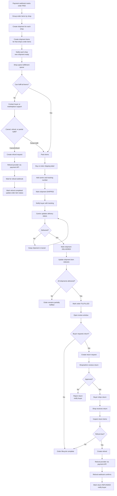

# Fulfillment Flow

Rules:
- Shipments are split by `shopId`; a multi-vendor order has multiple shop-owned shipments.
- Shipment items allocate quantities from order items, allowing partial fulfillment.
- Refund completion should follow payment provider confirmation, preferably webhook-backed.
- Return approvals and refund amounts are separate decisions from shipment delivery.
